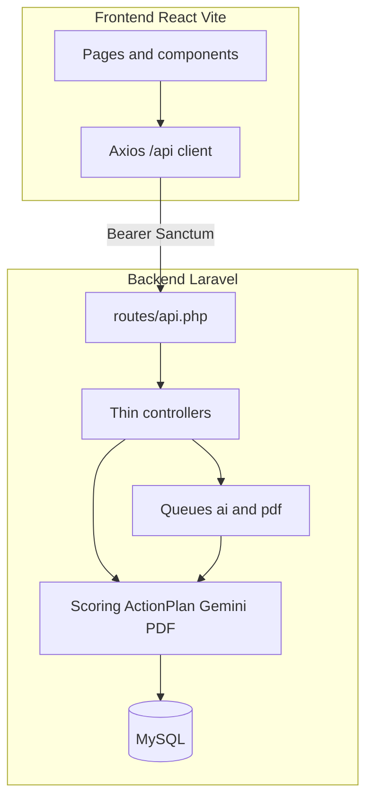
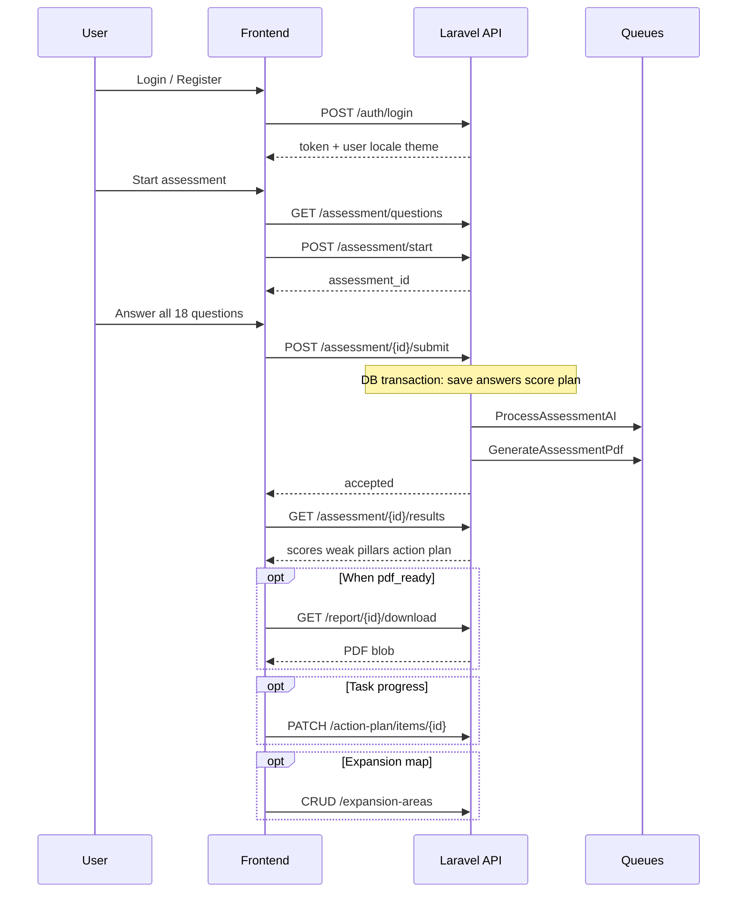
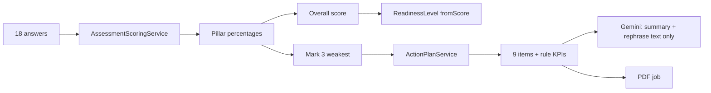

# HumaScale — System Flow Guide

**Last Updated:** 2026-08-26  
**Audience:** Backend developers, Frontend developers, Cursor agents  
**Canonical code:** `Backend/Backend` (Laravel) + `Frontend/humascale-frontend` (React)

This document is the **big-picture map**. Use it to understand how the system works end-to-end before opening deep API or module docs.

---

## 1. What the product does

HumaScale helps nonprofit teams measure **operational readiness**:

1. User answers **18 questions** (Likert 1–5) across **6 pillars**.
2. A **rule engine** calculates scores, readiness level, and the **3 weakest pillars**.
3. The same rules build a **3-phase action plan** (Immediate / Medium / Long) with fixed KPIs.
4. Optional **Gemini AI** only writes a summary and rephrases action text — it never changes decisions.
5. A **PDF report** is generated asynchronously for download.

| Pillar key | Arabic | English |
|---|---|---|
| `team` | الفريق | Team |
| `funding` | التمويل | Funding |
| `impact` | الأثر | Impact |
| `partnerships` | الشراكات | Partnerships |
| `technology` | التقنية | Technology |
| `sustainability` | الاستدامة | Sustainability |

**Official readiness thresholds**

| Score | Level |
|---|---|
| 0–49 | `low` |
| 50–69 | `medium` |
| 70–100 | `good` |

---

## 2. High-level architecture



| Role | Path | Responsibility |
|---|---|---|
| Frontend | `Frontend/humascale-frontend` | UI, i18n/theme display, call APIs, never recalculate business rules as source of truth |
| Backend | `Backend/Backend` | Auth, validation, ownership, scoring, plans, AI, PDF, preferences, map pins |
| Docs | `docs/` | Contracts and implementation guides |

---

## 3. Request pipeline (Backend)

Every protected API call follows the same path:

```text
HTTP request
  → Sanctum auth (if required)
  → Rate limit
  → FormRequest validation
  → Policy / ownership check
  → Controller (orchestration only)
  → Service / Job (business logic)
  → ApiResponse { success, message, data, errors?, meta? }
```

**Frontend contract:** always read `response.data.data` (Axios wraps the Laravel envelope once more as `response.data`).

---

## 4. Main user journey (happy path)



### Step-by-step (Frontend view)

| Step | Frontend action | Backend endpoint | Notes |
|---|---|---|---|
| 1 | Login | `POST /api/auth/login` | Store Bearer token |
| 2 | Load prefs | `GET /api/profile/preferences` or `/auth/me` | Apply `locale` + `theme` |
| 3 | Load questions | `GET /api/assessment/questions` | Use `*_ar` / `*_en` by locale |
| 4 | Start | `POST /api/assessment/start` | Keep `assessment_id` |
| 5 | Submit only if 18 answers | `POST /api/assessment/{id}/submit` | Scores must be 1–5 |
| 6 | Show results | `GET /api/assessment/{id}/results` | Prefer API `readiness_level` |
| 7 | Poll/report status | `GET /api/report/{id}/status` | No public PDF URL |
| 8 | Download PDF | `GET /api/report/{id}/download` | Blob + auth header |
| 9 | Update task status | `PATCH /api/action-plan/items/{id}` | Optional UX |
| 10 | Map pins | `/api/expansion-areas` | Optional feature |

---

## 5. Decision flow (Rule engine vs AI)



| Decision | Owner | Frontend must |
|---|---|---|
| Pillar % / overall score | Backend rules | Display API values |
| Readiness level | `ReadinessLevel::fromScore` | Match 50/70 if computing locally |
| Weakest 3 pillars | Backend (`is_weak`) | Highlight before plan |
| Plan phases & KPIs | `ActionPlanService` | Never invent KPIs from AI |
| AI summary / rephrase | Gemini (optional) | Fallback to rule text if `ai_ready` is false |

---

## 6. Domain model (simplified)

```text
User
 ├─ locale, theme
 ├─ assessments[]
 │    ├─ answers[] (question_id + score 1–5)
 │    ├─ pillar_results[] (percentage, is_weak)
 │    ├─ action_plan
 │    │    └─ items[] (phase, action_*, kpi_*, status)
 │    ├─ ai_summary_ar, ai_generated_at
 │    └─ pdf_path
 └─ expansion_areas[] (name_*, lat, lng, notes)

Pillar (6) ──< Question (3 each = 18)
```

---

## 7. Backend map for continuing work

| Concern | Where to look |
|---|---|
| Routes | `Backend/Backend/routes/api.php` |
| Scoring | `app/Services/AssessmentScoringService.php`, `app/Enums/ReadinessLevel.php` |
| Action plan + KPIs | `app/Services/ActionPlanService.php` |
| Submit / results | `app/Http/Controllers/User/AssessmentController.php` |
| Ownership | `app/Policies/AssessmentPolicy.php` |
| AI job | `app/Jobs/ProcessAssessmentAI.php`, `app/Services/GeminiNlgService.php` |
| PDF | `app/Jobs/GenerateAssessmentPdf.php`, `app/Services/PdfReportService.php` |
| Preferences | `app/Http/Controllers/User/ProfileController.php` |
| Map pins | `app/Http/Controllers/User/ExpansionAreaController.php` |
| Seed data | `database/seeders/PillarSeeder.php`, `QuestionSeeder.php` |
| Tests | `tests/Feature/*`, `tests/Unit/ReadinessLevelTest.php` |

### Local Backend checklist

```bash
cd Backend/Backend
composer install
cp .env.example .env   # DB, APP_KEY, FRONTEND_URL, GEMINI_API_KEY
php artisan migrate --seed
php artisan serve
php artisan queue:work --queue=ai,pdf,default
php artisan test
```

Without a queue worker, results still exist (rules), but AI summary and PDF stay pending.

---

## 8. Frontend map for continuing work

| Concern | Where to look |
|---|---|
| Routes | `src/App.jsx` |
| API client | `src/api/client.js` |
| Assessment API | `src/api/assessment.js` |
| Report download | `src/api/report.js` |
| Readiness helpers | `src/utils/constants.js` (**still needs 50/70 sync**) |
| Survey UI | `src/pages/user/Assessment.jsx` |
| Results / plan | `src/pages/user/AssessmentResults.jsx`, `components/assessment/ActionPlanView.jsx` |

**Do not rebuild** auth, assessment core, or Axios clients. Extend them.

Detailed next FE tasks: [`frontend-implementation-guide.md`](frontend-implementation-guide.md).

---

## 9. Parallel features (not on the scoring path)

These are independent of submit/scoring but share the same auth user:

| Feature | Purpose | API |
|---|---|---|
| Preferences | Persist language + theme | `GET/PATCH /api/profile/preferences` |
| Expansion areas | Geographic target pins for the org | `/api/expansion-areas` |
| Action item status | Track plan task progress | `PATCH /api/action-plan/items/{id}` |
| Notifications | Completion alerts | `/api/notifications` |
| Admin | Cross-user oversight | `/api/admin/*` |

---

## 10. Error meaning (shared language)

| HTTP | Meaning | Typical FE handling |
|---|---|---|
| 401 | Not logged in / bad token | Redirect to login |
| 403 | Not the owner | Show forbidden |
| 422 | Validation or business rule | Show `message` / field errors |
| 429 | Rate limited | Retry later |

Examples of **422 business rules:** incomplete survey, score outside 1–5, resubmit completed assessment, PDF not ready yet.

---

## 11. Reading order for a new developer

1. This file — system flow  
2. [`PROJECT_CONTEXT.md`](../PROJECT_CONTEXT.md) — decisions and paths  
3. [`backend-schema.md`](backend-schema.md) — tables and fields  
4. [`api-documentation.md`](api-documentation.md) — exact HTTP contracts  
5. [`backend.md`](backend.md) — Backend internals  
6. [`frontend.md`](frontend.md) + [`frontend-implementation-plan.md`](frontend-implementation-plan.md) — FE current vs next  
7. Module deep-dives: [`modules/scoring.md`](modules/scoring.md), [`action-plan.md`](modules/action-plan.md), [`map.md`](modules/map.md), [`i18n-theme.md`](modules/i18n-theme.md)  
8. Hoppscotch: [`hoppscotch/humascale.collection.json`](hoppscotch/humascale.collection.json)

---

## 12. Non-negotiable rules

1. Laravel + React are the only live stack (ignore Express dumps).
2. Rules decide; AI explains.
3. Bilingual API fields (`*_ar` / `*_en`); frontend picks language.
4. PDF only via authenticated download.
5. Users only touch their own assessments, plan items, and map pins.
6. Change Backend contracts only with matching API docs + Hoppscotch updates.
